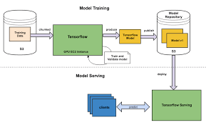
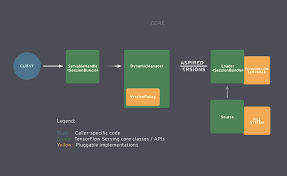

# Deep Learning Model Service

## 0. Index 
 **1. Tensorflow Serving**
 
 
 **2. Django, Flask**
  
 
 **3. 요약 및 결론**
 
      

## 1. Tensorflow Serving

### 1.1 Tensorflow Serving 개발 목적

딥러닝으로 만든 모델을 실제 서비스에 사용하고자 할 때, 사용하는 라이브러리이다. ***기존에는 서비스화하기 위해서 Inference하던 장비에다 WAS를 달고, 딥러닝 모델을 올리고, 들어온 자료를 배치로 만들고, 스케쥴링하고, 결과를 정리해서 Client에 보내는 모든 작업을 직접 구현하는 일련의 과정을 거쳐왔다.*** 이렇게 되면 **서비스를 개발하기 위한 작업량보다 훨씬 더 많은 시간을 투자해야하므로 비효율적**이다.

Tensorflow serving은 이러한 니즈에 맞추어 개발된 라이브러리이다. **Tensorflow로 개발된 모델 혹은 Tensorflow로 변환이 가능한 모델에 대해 버전관리, batching, intput/output 관리 등을 수행해주어 딥러닝 모델을 이용한 서비스를 누구나 쉽게 개발 할 수 있게 도와준다.**

REST, gRPC형태의 API의 기본적인 기능을 모두 제공하고 있어 Client side에서 편하게 사용할 수 있다. REST, gRPC의 형태는 Client의 언어에 구애받지 않기때문에 어떤 플랫폼, 어떤 언어에서도 Server에 대한 호출이 가능하다. 

Serving은 Google에서 개발/관리 되는 라이브러리이며 비슷한 것으로는 **Nvidia에서 제공하는 TensorRT inference server**가 있다.

### 1.2 Model Service 정의

Model Serving한다는 것은 inference를 의미한다. 

 - 대표적인 3가지 방법
   - **Tensorflow Serving**
    - Python : tensorflow-serving-api 사용
    - 다른 언어 : bazel 빌드
    - Serving시 Python 사용하면 퍼포먼스가 상대적으로 좋지 않음
    - 어려운 이유
      - C++ code. Tensorflow 사용하는 사람들은 대부분 Python만 익숙.
      - Kubernetes, gRPC, bazel 등 설정해야하는 부분이 많음.
      - Compile 필요하고 오래 걸림
   - **Google Cloud CloudML**
     - 장점 : 쉬움! CloudML이 다 해줌
     - 단점 : 비용 발생 및 알고리즘 유출 가능성
   - **Flask를 사용한 API**
     - 장점 : 빠르게 Prototype 만들 때 사용 가능
     - 단점 : 초당 API Request가 많은 대용량 서비스라면 사용하기 힘듬(퍼포먼스 이슈)

정리하면 Tensorflow Serving보다 다른 방법(CloudML, Flask)은 상대적으로 쉬운 편이고, CloudML은 노드 시간당 비용이 발생하고, Flask 사용한 방법은 대용량 Request에 버티기 힘들다.

결국, 주어진 상황에 따라 선택하면 될 듯하다. ***DGX Station을 활용한 모델을 염두한다면, Tensorflow Serving이나 Flask로 구현***하는 것이 바람직해 보인다.

### 1.3 Serving Structure

## 2. Django, Flask

### 2.1 Django 프레임워크

장고프레임워크란 파이썬으로 작성된 오픈 소스 웹 애플리케이션 프레임워크로 쉽고 빠르게 웹사이트를 개발할 수 있도록 돕는 구성요소로 이루어져 있습니다.
파이썬 프로그래밍 자체가 다른 프로그래밍에 비해 배우기 쉽고 쓰기 편하게 되어 있기 때문에 개발기간을 상당히 단축시킬 수 있습니다. 장고프레임워크는 그에 수반되는 강력한 라이브러리들을 그대로 사용할 수 있다는 점이 가장 큰 장점이라고 볼 수 있습니다.

장고프레임워크 특징
- MVC 패턴 기반 MTV (기본적으로 Model-View-Controller 를 기반으로 한 프레임워크)
- ORM(Object-relational mapping) 기능 지원
- 쉬운 DB관리를 위해 프로젝트를 생성하면서 관리자기능을 제공
- 쉬운 URL 파싱 기능 지원
- 동일한 소스코드에서 다른 나라에서 용이하도록 번역, 날짜/시간/숫자 등의 포맷 타임존 지정 등의 기능을 제공

### 2.2 Flask

Flask는 경량화된 웹 프레임워크, 그리고 마이크로 서비스, 필요한 요소요소들을 하나하나 추가해서 사용하면 되는 프레임워크로 자료들이 검색 되었다. Django가 spring과 비교된다면 flask는 spring boot와 비슷한 느낌이다. 구현이 훨씬 간단하고 심플하다. 

### 3. 요약 및 결론

웹페이지에서 **Feature, Model Layer, learning Rate 등의 Hyper Parameter 등을 튜닝**하고, 원격으로 DGX의 work sation에 접속해서 Model Service를 하는 것이 목표이다.

지금 상황에서 파악한 바로는 Tensorflow  Serving, CloudML, Django, Flask 모두 **완성된 모델으로 서비스**를 하는데에는 최적화가 되어 있지만, **웹 자체에서 모델을 튜닝**하는 것은 제약이 많이 따를 것으로 보인다.

서버에 **Request를 해서 그 모델에 대하여 결과값을 받아 오는 것은 가능**하지만, **모델 자체를 튜닝하라는 Request를 보내는 것**이 가능한지는 웹 어플리케이션의 전문 지식이 필요하다.
