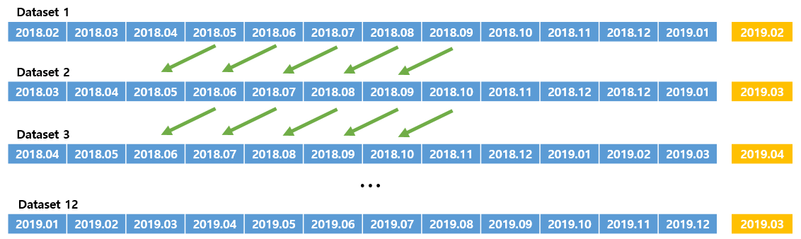

# USD 환율 가격 예측 모형

### 1. Data Loading

- **1.1 Sliding Window Dataset**

  - 시계열 데이터의 경우 장기간의 데이터를 사용하는 것보다 **영향력이 더 강한 최근 데이터**만 사용하여 모델을 만드는 것이 더 성능이 좋음.'
  - 모델의 **일반화(Generalization)** 확보를 위해서 각 월별로 1개의 모델, 총 12개의 모델을 생성

  - 

- **1.2 Train & Valid & Test**
  - 각 Dataset 별로 앞에서부터 **11개월간을 Train**으로 사용하고, **12번째 월은 Valid**로 사용, 마지막 **13번째 열은 Test**로 사용한다.
  - **Train : Valid : Test = 84 : 8 : 8**

### 2. Feature Engineering

### 3. EDA(Exploratory Data Analysis)

- **[Python Code]([https://github.com/ajskdlf64/Exchange-Rate-Point-Search/blob/master/Code/01.%20Data%20Loading%20%26%20EDA.ipynb](https://github.com/ajskdlf64/Exchange-Rate-Point-Search/blob/master/Code/01. Data Loading %26 EDA.ipynb))**

### 4. Modeling