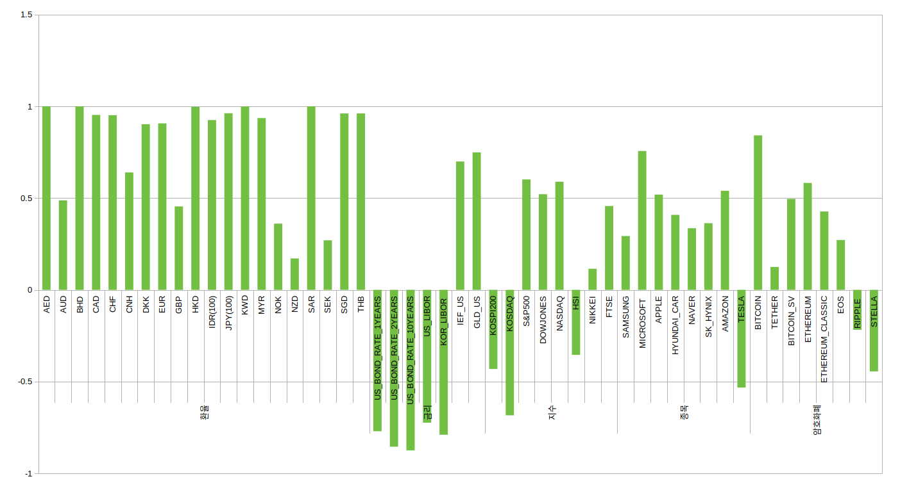
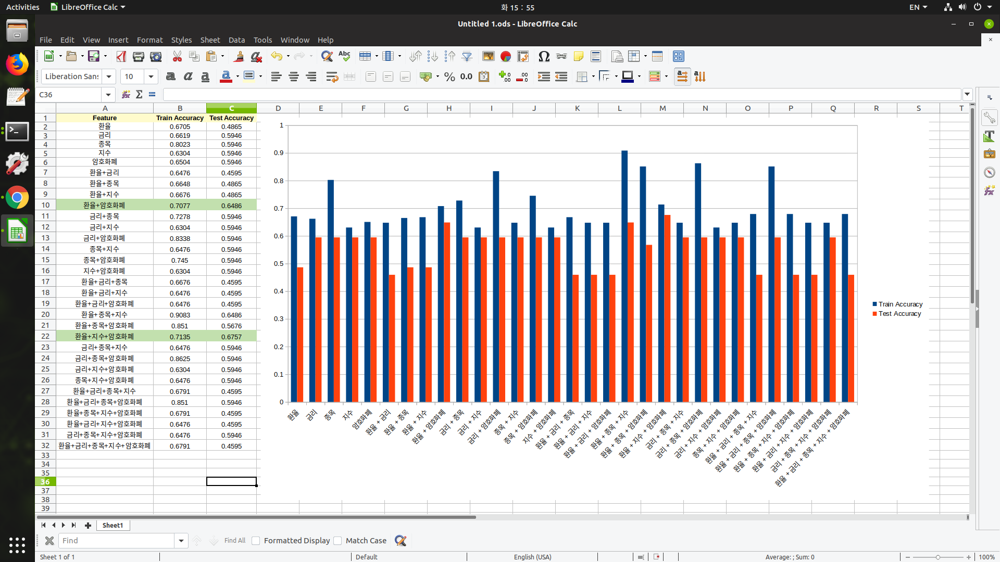

# Exchagne Rate Predict Model

***

### 1. Data Loading

- **1.1 Sliding Window Dataset**

  - **1.1.1** 시계열 데이터의 경우 장기간의 데이터를 사용하는 것보다 **영향력이 더 강한 최근 데이터**만 사용하여 모델을 만드는 것이 더 성능이 좋음.'
  - **1.1.2** 모델의 **일반화(Generalization)** 확보를 위해서 각 월별로 1개의 모델, 총 12개의 모델을 생성

    

- **1.2 Train & Valid & Test**
  
  - **1.2.1** 각 Dataset 별로 앞에서부터 **11개월간을 Train**으로 사용하고, **12번째 월은 Valid**로 사용, 마지막 **13번째 열은 Test**로 사용한다.
  - **1.2.1** Train : Valid : Test = 84 : 8 : 8

***

### 2. EDA

- **2.1 기대 이익 (2019년 2월 ~ 2020년 1월 기간 동안)** 
  - **2.1.1** **매일 1달러씩** 매입하였을 때 비용은 ***285,334원***
  - **2.1.2** **1년 중 최저가로  245 달러**를 매입하였을 때 비용은 ***272,342원***, 이 때의 수익률은 **4.55%**
  - **2.1.3** **매월 최저가로  245 달러**를 매입하였을 때 비용은 ***282,634원***, 이 때의 수익률은 **0.95%**

***

### 3. Model 1 : Deep Neural Network
- **3.1 모델 설명**
   - **3.1.1** Keras를 활용하여 2층 구조의 DNN 모델 설계.
   - **3.1.2** Overfitting 방지를 위해서, 2개의 층만 설정, L1, L2 규제 사용, Dropout(0.5)
   - **3.1.3** 활성화함수 : ReLU, Loss : RMSE, Epoch : 300, batch_size : 300
  
- **3.2 모델 코드**
  - **3.2.1** Set1만 돌렸을 때의 코드 **-> [Set1 Code](https://github.com/ajskdlf64/Exchange-Rate-Point-Search/blob/master/Code/02.%20DNN%20Set1.ipynb)**
  - **3.2.2** Set1 ~ Set12를 모두 돌렸을 때의 코드 **-> [Set1 ~ Set12 Code](https://github.com/ajskdlf64/Exchange-Rate-Point-Search/blob/master/Code/03.%20DNN%20Set1%20_%20Set12.ipynb)**
  - **3.2.3** Model 최적화 진행 코드 **-> [Model Optimization](https://github.com/ajskdlf64/Exchange-Rate-Point-Search/blob/master/Code/04.%20DNN%20Set1%20_%20Set12%20(Parameter%20Setting).ipynb)**
  
 - **3.3 결과 요약**
   - **3.3.1** 12개의 Dataset(1년,255일)을 예측하기 위해 필요한 ***Model Service 시간은 약 40초 (1set 당 약 3초)***
   - **3.3.2** 1일 뒤의 상승,하락을 예측하는 경우 ***1년 평균 80%의 정확도***를 보이고 있음.
   - **3.3.3** 그러나, 1년간 매입 시뮬레이션으로 돌릴 경우, ***-1% ~ +1%의 원가 절감***이 기대됨. 그러나 모델이 너무 불안정하다는 단점이 있음.(시뮬레이션 진행마다 결과의 편차가 큼)
   - **3.3.4** 확실한 수익을 얻기 위해서는 매수 시점 탐색뿐만 아니라, 매도 시점 탐색을 위한 모델도 필요함. -> ***적절한 매수, 매도가 진행되어야지만 확실한 수익이 보장.***
  
***

### 4. Model 2 : Machine Learning
- **4.1 모델 설명**
  - **4.1.1** 다양한 머신러닝 기법을 활용하여 다음날의 UP, DOWN을 예측
  - **4.1.2** PCA를 통해 Feature Engineering 진행
  - **4.1.3** Online 학습으로, 내일을 예측하기 위해 최근 1년 데이터만 사용. 그 후 다음날은 다시 최근 1년의 데이터로 모델 재설계의 방식으로 구성
  - **4.1.4** SMOTE 기법을 활용하여 Over Sampling
  
- **4.2 모델 코드**
  - **4.2.1** **[Base Machine learning Model](https://github.com/ajskdlf64/Exchange-Rate-Point-Search/blob/master/Code/06.%20Machine%20Learning%20Base%20Model.ipynb)**
  - **4.2.2** **[Principal Component Analysis](https://github.com/ajskdlf64/Exchange-Rate-Point-Search/blob/master/Code/07.%20Model%20(PCA).ipynb)**
  - **4.2.3** **[Online Learning & Grid Search](https://github.com/ajskdlf64/Exchange-Rate-Point-Search/blob/master/Code/09.%20Model%20(1DAY%2C%20GRIDSERACH).ipynb)**
  - **4.2.4** **[SMOTE Over Sampling](https://github.com/ajskdlf64/Exchange-Rate-Point-Search/blob/master/Code/10.%20Model%20(Smote%20Sampling).ipynb)**

- **4.3 결과 요약**
  - **4.3.1** XGBoost의 Base Model의 1년 평균 정확도가 56% 정도에서, PCA를 진행할 경우 46%로 오히려 떨어지는 현상이 나타남. --> PCA를 하기 위한 충분한 Feature 확보가 이루어지지 않은 것을 판단. 최소한 20개 이상의 Feature 확보 후 PCA 진행.
  - **4.3.2** 오늘로부터 최근 200개의 데이터를 통해 학습한뒤 내일을 예측하고, 다음날은 모델을 리셋시켜 또 최근 200개의 데이터를 이용해 학습하고 모델을 만드는 Online Learning 기법을 적용 및 그리드 서치를 통해 최적의 하이퍼 파라미터 탐색 -> 기본의 모델보다 정확도가 약 2~3% 향상.
  - **4.3.3** SMOTE 샘플링을 진행한 결과, 성능이 오차 범위 이내에서 나아지지 않음. --> SMOTE 기법의 경우, Rare Event(Ground Truth가 9:1 로 극단적인 경우)에서는 성능이 크게 개선되지만, 애초에 Original Data의 비율이 비슷한경우 성능이 나아지지 않는다. 그 이유는 SMOTE가 샘플링을 할 때 더 많은쪽의 라벨을 기준으로 소수의 데이터를 오버샘플링 하기 때문이다. 따라서 환율 모델의 경우 애초에 5:5의 비율을 띄고 있기 때문에 Smote 기법은 큰 의미가 없어 보인다. 샘플링 보다는 오히려 더 많은 수의 관측치를 확보하는 게 더 우선이다.
  
***

### 5. Model 3 : XGBoost
- **5.1 모델 설명**
  - **5.1.1** 24시간 뒤의 환율 가격을 예측하기 위해서 최대한의 많은 Feature를 확보한 다음 모델 구축. **[DB Code](https://github.com/ajskdlf64/Exchange-Rate-Point-Search/blob/master/Code/11.%20New%20DB.ipynb)**

- **5.2 모델에 포함된 변수**
  - **5.2.1 환율(21)** - AED, AUD, BHD, CAD, CHF, CNH, DKK, EUR, GBP, HKD, IDR(100), JPY(100), KWD, MYR, NOK, NZD, SAR, SEK,    SGD, THB, USD
  - **5.2.2 금리(7)** - US_BOND_RATE_1YEARS, US_BOND_RATE_2YEARS, US_BOND_RATE_10YEARS, USLIBOR, KORLIBOR, IEF_US, GLD_US
  - **5.2.3 종목(8)** - HYUNDAI_CAR, MICROSOFT, APPLE, SAMSUNG, SK HYNIX, AMAZON, TESLA, NAVER
  - **5.2.4 지수(8)** - KOSPI200, KOSDAQ, S&P500, DOWJONES, NASDAQ, HSI, FTSE, NIKK255
  - **5.2.5 기타 종목(8)** - BITCOIN, TETHER, BITCOIN_SV, ETHEREUM, ETHEREUM_CLASSIC, EOS, RIPPLE, STELLAR
  
  
 
- **5.3 변수구분에 따른 모든 조합에 대하여 분류 정확도 계산**
  - **5.3.1** - **[Model Code](https://github.com/ajskdlf64/Exchange-Rate-Point-Search/blob/master/Code/12.%20Model.ipynb)**
    
    
***

### 6. Model 4 : RNN, LSTM, GRU
 - **6.1 모델 개요**
   - 10년(2010년 1월 ~ 2020년 1월)의 데이터를 활용해서 LSTM 모델 구성

 - **6.2 Feature Selecting**
   - 모델에 사용된 변수는 CAD, CHF, EUR, GBP, JPY, USD만 사용

 - **6.3 Model Code**
   - **[Original Model](https://github.com/ajskdlf64/Exchange-Rate-Point-Search/blob/master/Code/13.%20Model%20(LSTM).ipynb)**
   - **[Multi Model](https://github.com/ajskdlf64/Exchange-Rate-Point-Search/blob/master/Code/14.%20Model%20(Final%20LSTM).ipynb)**

 - **6.4 기준점**
   - RMSE = 29 (오늘의 값을 내일의 값이라고 예측한 경우의 RMSE)

 - **6.5 사용한 모델 (모델 학습 시간 평균 5 min)**
   - 완전 연결 계층을 이용한 모델
   - GRU를 사용한 모델
   - 드롭아웃 규제된 GRU를 사용한 모델
   - 드롭아웃으로 규제하고 스태킹한 GRU 모델
   - 양방향 순환 레이어 모델

 - **6.6 결론 및 시사점**
   - lookback, delay, step 등과 dense, layer, dropout, l1, l2, 스태킹, GRU, LSTM, 양방향 등의 각각의 하이퍼 파라미터를 셋팅해서 최대한 많은 수의 모델들을 생성
   - 이 각각의 모델들을 한명의 펀드 매니저라고 생각. 하나의 모델로 단정짓는 것이 아니라 여러개의 모델들의 예측 값중 평균이나, 중앙값 혹은 수학적인 알고리즘을 통해 내일을 예측
   - UP DOWN 예측 역시 각각의 모델들의 방향 평가 중 더 많이 나온 방향을 최종 방향으로 선택
   - 예측을 구간(범위)으로 할경우 역시, 여러 모델들의 최솟값과 최댓값으로 표시(필요하다면 outlier 제거)
